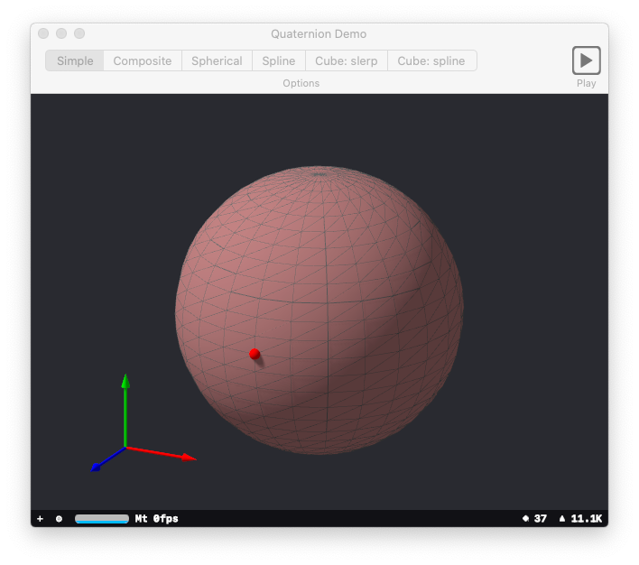

This original demo was developed by Apple's Engineers and the source code can be downloaded at the following link:

https://developer.apple.com/documentation/accelerate/rotating_a_cube_by_transforming_its_vertices

Code has been added to enable the demo to be compiled and run on a computer running under macOS. In particular, a CoreVideo display link (CVDisplayLink) object is instantiated to perform a per-frame update.

To allow selection of the various options, a NSToolbar object is instantiated in IB. A subclass of NSWindowController is used to support a response to click on the toolbar.

